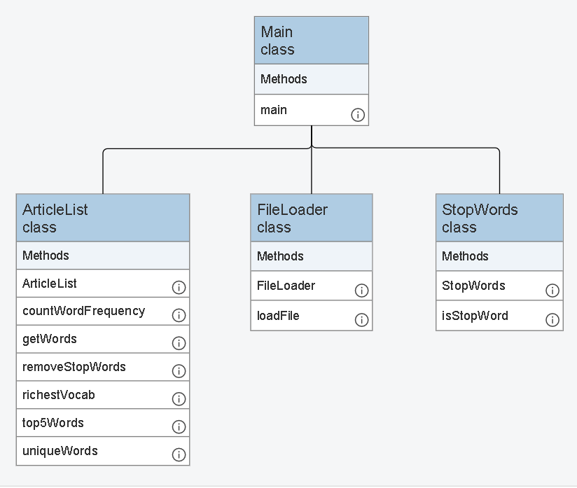

# Lab Project

## This project is to code a program that runs basic text analysis with the goal of comparing articles about the same topics.

- **Group Members**:
    - Lauren Lanning
    - Jake Samuel
    - Isabela Arteaga

### Article Topics: 
1. Why owning a dog is good
2. Why owning a cat is good
3. Soccer

## Milestone 3 Abstract
After completing this milestone, the software application is now fully interactive and allows the end user to choose which topic they want to analyze and to add new articles directly into the system. The overall goal of this milestone is to make the application usable without modifying the code each time a new dataset needs to be analyzed.

To achieve this, we collected and articles about the same topics. Then each article is processed by preforming the following tasks:
1. **Loading Text Files:** The FileLoader class reads text content from article files and puts the content into an array list of individual words while removing punctuation.
2. **Stop Words Removal:** Using the StopWords class, common stop words are filtered out from the array list leaving only meaniful terms.
3. **Basic Statistics:** A method in the FileLoader class displays the total word cound and the number of unique words remaining after the removal of stop words.
4. **Word Frequency Ranking:** The frequency disribution of the remaining words is calculated and displayed, helping to identify key terms used in each article.
5. **Which article used the richest Vocabulary?** We used the richestVocab method in the ArticleList class to compare the number of unique words in each article and determine which had the richest vocabulary.
6. **What list of words were repeated the most per article?** We used the top5Words method in the ArticleList class to identify and display the five most frequently used words in each article.
7. **Which articles expressed "positive" vs "negative" attitude:** ...
8. **Topic selection by the user:** ...
9. **Running analysis on selected topic:** ...
10. **Adding new articles provided by the user:** ...
11. **Menu driven user interface:** ...

The application is composed using four distinct classes- Main, FileLoader, StopWords, and ArticleList. These seperate classes ensure clarity and processing that will help with more advanced features in future milestones.

